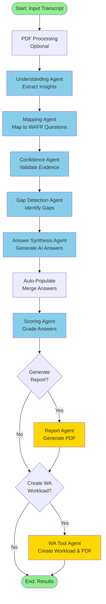
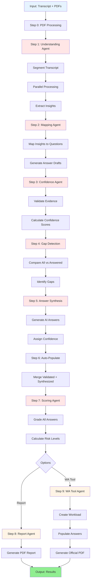
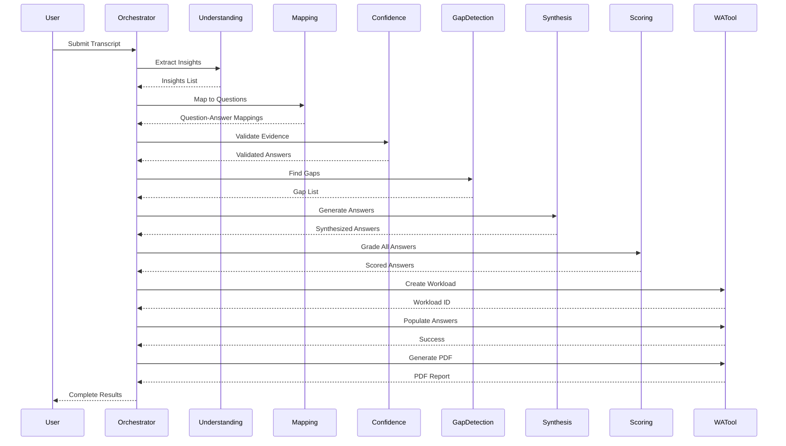
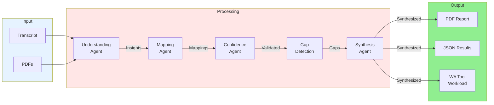
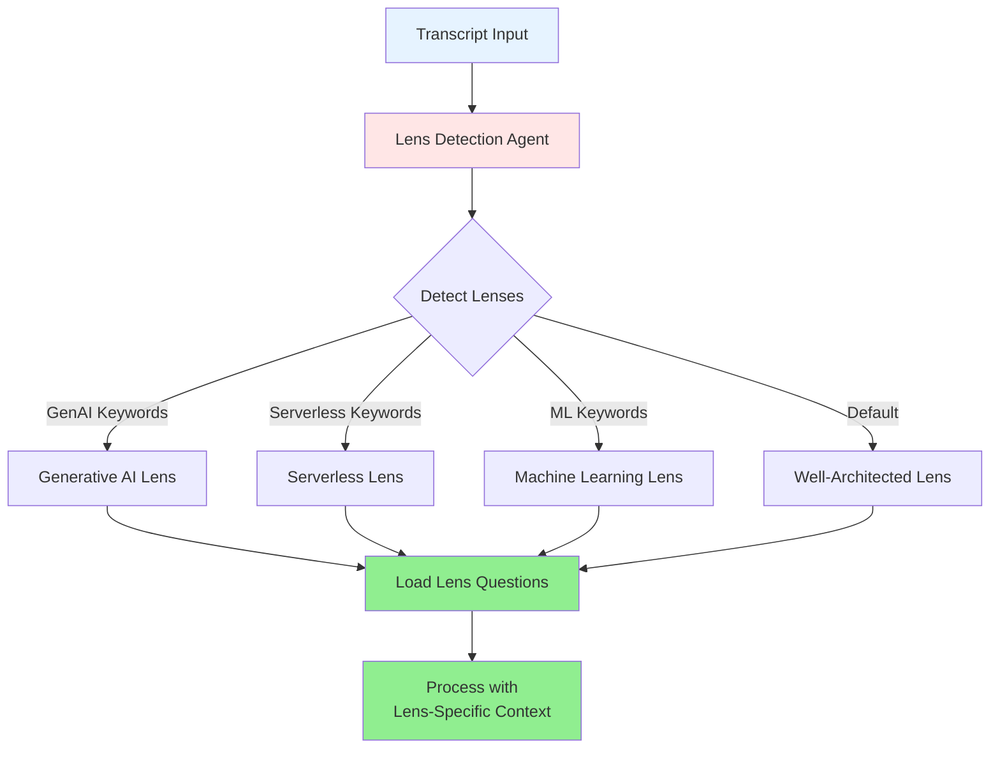
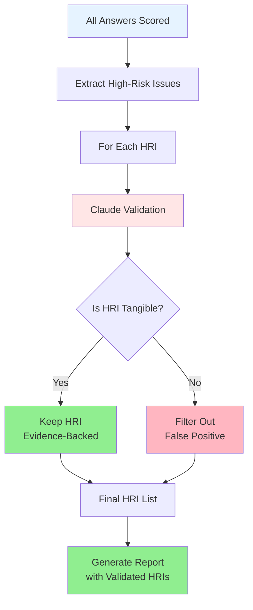
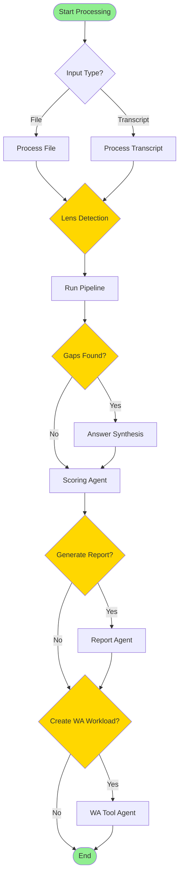

# WAFR - Well-Architected Framework Review System

An AI-powered multi-agent system for automated AWS Well-Architected Framework assessments.

## Overview

WAFR automatically analyzes workshop transcripts using specialized AI agents powered by Amazon Bedrock (Claude Sonnet). The system processes natural language transcripts through a coordinated pipeline to extract insights, map to WAFR questions, validate evidence, and generate comprehensive assessments with PDF reports.

## Features

- ✅ **Multi-Agent AI Pipeline**: Specialized agents for understanding, mapping, confidence validation, gap detection, and more
- ✅ **AG-UI Integration**: Real-time event streaming for frontend applications
- ✅ **Strict Quality Control**: Confidence threshold >= 0.7, honest assessment
- ✅ **HRI Validation**: Claude-based validation to filter non-tangible HRIs
- ✅ **Automatic Lens Detection**: Identifies relevant AWS Well-Architected Lenses from transcript
- ✅ **WA Tool Integration**: Creates workloads and generates official PDF reports
- ✅ **Enhanced Question Answering**: Intelligent inference with evidence validation

## Quick Start

### Prerequisites

- Python 3.10+
- AWS credentials configured (for Bedrock and Well-Architected Tool)
- Required packages (see `config/requirements.txt`)

### Installation

```bash
# Install dependencies
pip install -r config/requirements.txt

# Optional: Install AG-UI protocol for event streaming
pip install ag-ui-protocol
```

### Run the Pipeline

**Windows:**
```batch
scripts\run_wafr_full.bat "My Client Name"
```

**Linux/Mac:**
```bash
chmod +x scripts/run_wafr_full.sh
./scripts/run_wafr_full.sh "My Client Name"
```

**Python (any platform):**
```bash
python scripts/run_wafr_full.py --wa-tool --client-name "My Client Name"
```

### With Custom Transcript

```bash
python scripts/run_wafr_full.py \
    --transcript data/transcripts/my_transcript.txt \
    --wa-tool \
    --client-name "Client Name"
```

## Project Structure

```
WAFR-prototype/
├── src/wafr/          # Source code (agents, ag_ui, models, storage)
├── scripts/           # Executable scripts
├── docs/              # Documentation
├── data/              # Data files (knowledge_base, schemas, lenses, transcripts)
├── output/            # Generated outputs (logs, reports, results)
└── config/            # Configuration files
```

See [PROJECT_STRUCTURE.md](docs/PROJECT_STRUCTURE.md) for detailed structure documentation.

## Documentation

- **[SYSTEM_DESIGN.md](docs/SYSTEM_DESIGN.md)**: System architecture and design
- **[CODE_REVIEW_GUIDE.md](docs/CODE_REVIEW_GUIDE.md)**: Comprehensive code review guide
- **[PROJECT_STRUCTURE.md](docs/PROJECT_STRUCTURE.md)**: Project organization guide
- **[AG_UI_INTEGRATION_GUIDE.md](docs/AG_UI_INTEGRATION_GUIDE.md)**: AG-UI integration documentation

## Architecture

The system uses a **coordinated multi-agent architecture**:

```
Orchestrator
    ├── Understanding Agent (extracts insights)
    ├── Mapping Agent (maps to WAFR questions)
    ├── Confidence Agent (validates evidence)
    ├── Gap Detection Agent (identifies gaps)
    ├── Answer Synthesis Agent (synthesizes answers)
    ├── Scoring Agent (grades and ranks)
    ├── WA Tool Agent (creates workload, generates PDF)
    └── Report Agent (generates reports)
```

Each agent is specialized for a specific task and uses Claude Sonnet via Amazon Bedrock.

### System Architecture Flow



### Detailed Processing Pipeline



### Agent Interaction Flow



### Data Flow Diagram



### Lens Detection Flow



### HRI Validation Flow



### Quick Reference: Decision Points



## Configuration

### Environment Variables

- `AWS_REGION`: AWS region (default: us-east-1)
- `BEDROCK_MODEL_ID`: Bedrock model ID (default: anthropic.claude-sonnet-3-5-20241022-v2:0)
- `WA_TOOL_ENABLED`: Enable WA Tool integration (default: true)

### AWS Credentials

Configure AWS credentials using one of:
- AWS CLI: `aws configure`
- Environment variables: `AWS_ACCESS_KEY_ID`, `AWS_SECRET_ACCESS_KEY`
- IAM roles (if running on EC2)

## Output

The system generates:

- **PDF Reports**: Official AWS Well-Architected Framework reports
  - Location: `output/reports/wafr_report_{workload_id}_{session_id}.pdf`
  
- **JSON Results**: Complete assessment results
  - Location: `output/results/wafr_results_{session_id}.json`
  
- **Logs**: Detailed execution logs
  - Location: `output/logs/wafr_{timestamp}.log`

## Development

### Project Structure

The project follows a clean, professional structure:

- **`src/wafr/`**: Main package with all source code
- **`scripts/`**: Executable scripts
- **`docs/`**: Documentation
- **`data/`**: Data files
- **`output/`**: Generated outputs
- **`config/`**: Configuration files

### Adding New Agents

1. Create agent file in `src/wafr/agents/`
2. Implement agent class following existing patterns
3. Register in orchestrator (`src/wafr/agents/orchestrator.py`)
4. Update imports and exports

### Running Tests

```bash
# Run all tests
python -m pytest tests/

# Run specific test
python -m pytest tests/test_specific.py
```

## License

Copyright (c) 2024

## Support

For issues, questions, or contributions, please refer to the documentation in the `docs/` directory.

