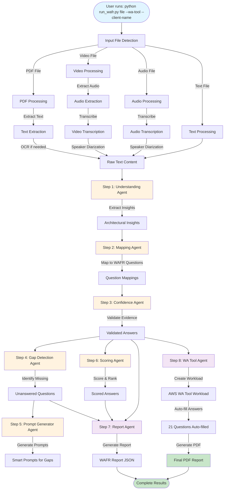
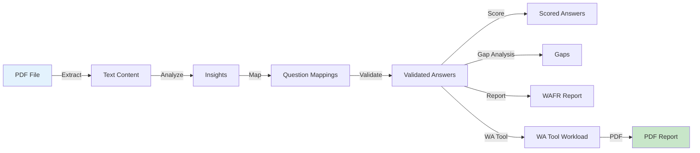
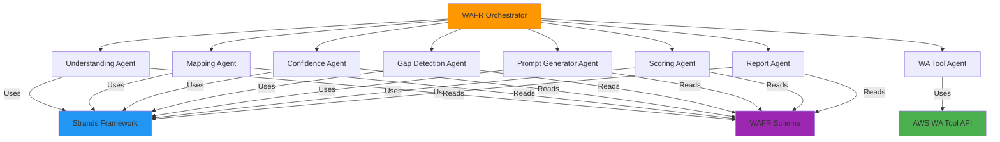

# WAFR Agent Workflow Documentation

## Overview

This document explains the complete workflow that takes place when processing input files (PDF documents, video recordings, audio files, or text transcripts) through the WAFR (Well-Architected Framework Review) agent system to generate a comprehensive assessment report.

**Supported Input Formats:**
- **Text Files**: `.txt`, `.md`, `.rst` - Direct text input
- **PDF Documents**: `.pdf` - Text-based and scanned PDFs with OCR support
- **Video Files**: `.mp4`, `.webm`, `.mov`, `.avi`, `.mkv`, `.m4v`, `.wmv` - Video recordings with transcription
- **Audio Files**: `.mp3`, `.wav`, `.m4a`, `.flac`, `.ogg`, `.aac` - Audio recordings with transcription

## Workflow Diagram



## Detailed Workflow Steps

### Phase 0: Input Processing

**Location**: `run_wafr.py` → `agents/input_processor.py`

1. **File Detection**
   - The system detects the input file type (PDF, text, video, audio)
   - For PDF files, it uses `InputProcessor.detect_input_type()`
   - Determines processing strategy based on file type

2. **PDF Text Extraction**
   - Uses `PDFProcessor` to extract text from PDF
   - Supports multiple extraction methods:
     - Direct text extraction for text-based PDFs
     - Amazon Textract for scanned PDFs (if enabled)
     - OCR fallback using pytesseract (if Textract unavailable)
   - Extracts additional content:
     - Images and diagrams
     - Tables
     - Metadata

3. **Video/Audio Processing** (NEW)
   - Uses `VideoProcessor` to extract and transcribe audio
   - **Audio Extraction**:
     - Extracts audio track from video files using ffmpeg
     - Converts to WAV format (16kHz, mono) for optimal transcription
     - Handles various video formats: MP4, WebM, MOV, AVI, MKV, etc.
   - **Transcription Options**:
     - **Amazon Transcribe** (default, if S3 bucket provided):
       - High-quality speech-to-text conversion
       - Speaker diarization (identify different speakers)
       - Language support (en-US, es-ES, fr-FR, etc.)
       - Requires S3 bucket for file upload
     - **OpenAI Whisper** (fallback/local):
       - Local transcription without AWS
       - Good accuracy, no cloud dependency
       - No speaker diarization
       - Requires: `pip install openai-whisper`
   - **Output Format**:
     - Timestamped transcript segments
     - Speaker labels (if diarization enabled)
     - Confidence scores per segment
     - Formatted transcript with timestamps

4. **Content Normalization**
   - Converts extracted content to standardized format
   - Creates `ProcessedInput` object with:
     - `content`: Extracted text
     - `input_type`: File type
     - `metadata`: Processing information
     - `word_count`: Total words extracted
     - `confidence`: Extraction confidence score

### Phase 1: Understanding Agent

**Location**: `agents/orchestrator.py` (Step 1) → `agents/understanding_agent.py`

**Purpose**: Extract architectural insights from the document

1. **Processing**
   - Receives the extracted text content
   - Uses AI agent (Strands framework) to analyze the document
   - Identifies key architectural components:
     - Services used (e.g., Amazon SageMaker, Amazon Neptune)
     - Decisions made (e.g., serverless architecture)
     - Patterns implemented
     - Technologies selected

2. **Output**
   - List of insights with types:
     - `decision`: Architectural decisions
     - `service`: AWS services used
     - `pattern`: Design patterns
     - `technology`: Technology choices
   - Each insight includes:
     - Content description
     - Source location
     - Metadata

**Example Output**:
- 38 insights extracted from Alphabiomics proposal
- Identified services: Amazon Amplify, Amazon Bedrock, Amazon Neptune, etc.

### Phase 2: Mapping Agent

**Location**: `agents/orchestrator.py` (Step 2) → `agents/mapping_agent.py`

**Purpose**: Map extracted insights to specific WAFR questions

1. **Question Matching**
   - Compares insights against WAFR schema (51 questions across 6 pillars)
   - Calculates relevance scores for each mapping
   - Maps insights to appropriate WAFR questions

2. **Pillar Coverage**
   - Tracks coverage across pillars:
     - Operational Excellence (OPS)
     - Security (SEC)
     - Reliability (REL)
     - Performance Efficiency (PERF)
     - Cost Optimization (COST)
     - Sustainability (SUS)

3. **Output**
   - Mappings with:
     - Question ID and text
     - Pillar assignment
     - Relevance score (0-1)
     - Evidence quotes from document
     - Answer content

**Example Output**:
- 26 mappings created
- Questions mapped to insights with relevance scores

### Phase 3: Confidence Agent

**Location**: `agents/orchestrator.py` (Step 3) → `agents/confidence_agent.py`

**Purpose**: Validate evidence and assign confidence scores

1. **Evidence Validation**
   - Verifies that evidence quotes exist in source document
   - Checks for direct quotes vs. inferred information
   - Validates accuracy of mappings

2. **Confidence Scoring**
   - Assigns confidence scores (0-1) based on:
     - Evidence quality
     - Quote accuracy
     - Completeness of answer
   - Categorizes confidence levels:
     - High: >0.8
     - Medium: 0.5-0.8
     - Low: <0.5

3. **Answer Validation**
   - Creates validated answers with:
     - Confidence score
     - Evidence verification status
     - Validation passed/failed flag
     - Issues or concerns identified

**Example Output**:
- 26 validations completed
- Average confidence: 88.80%
- High confidence answers prioritized

### Phase 4: Gap Detection Agent

**Location**: `agents/orchestrator.py` (Step 4) → `agents/gap_detection_agent.py`

**Purpose**: Identify unanswered WAFR questions

1. **Gap Analysis**
   - Compares answered questions against full WAFR schema
   - Identifies questions not covered by document
   - Calculates priority scores for gaps

2. **Priority Scoring**
   - Assigns priority based on:
     - Pillar importance
     - Question criticality
     - Coverage gaps
   - Ranks gaps for attention

3. **Output**
   - List of gaps with:
     - Question ID and text
     - Priority score
     - Pillar assignment
     - Reason for gap

**Example Output**:
- 35 gaps identified
- Top gaps in Sustainability pillar
- Priority scores for remediation

### Phase 5: Prompt Generator Agent

**Location**: `agents/orchestrator.py` (Step 5) → `agents/prompt_generator_agent.py`

**Purpose**: Generate helpful prompts for unanswered questions

1. **Smart Prompt Generation**
   - Creates contextual prompts for each gap
   - Includes:
     - Best practice hints
     - Example answers
     - Quick-select options
     - Guidance specific to question

2. **Contextualization**
   - Uses document context to tailor prompts
   - Provides relevant examples
   - Suggests AWS services/patterns

**Output**: List of prompts for top 10 gaps

### Phase 6: Scoring Agent

**Location**: `agents/orchestrator.py` (Step 6) → `agents/scoring_agent.py`

**Purpose**: Score and rank answers

1. **Answer Scoring**
   - Evaluates answers against WAFR best practices
   - Scores based on:
     - Confidence (40%)
     - Completeness (30%)
     - Compliance (30%)
   - Assigns letter grades (A-F)

2. **Risk Assessment**
   - Categorizes answers by risk level:
     - HIGH: Grade F
     - MEDIUM: Grade D
     - LOW: Grades A-C

3. **Ranking**
   - Ranks answers by priority
   - Identifies high-risk issues
   - Creates review queues

**Example Output**:
- 16 answers scored
- Risk distribution: 17 High, 4 Medium, 0 Low

### Phase 7: Report Agent

**Location**: `agents/orchestrator.py` (Step 7) → `agents/report_agent.py`

**Purpose**: Generate comprehensive WAFR assessment report

1. **Report Generation**
   - Compiles all assessment data:
     - Validated answers
     - Confidence scores
     - Gap analysis
     - Pillar coverage
   - Generates report in official AWS format

2. **Report Structure**
   - Executive Summary
     - Overall assessment
     - Risk summary
     - Progress status
   - Pillar Analysis
     - Per-pillar breakdown
     - Risk distribution
     - Key observations
   - High-Risk Issues
     - Detailed HRI descriptions
     - Recommendations
   - Improvement Plan
     - Prioritized actions
     - Phase-based roadmap

3. **Output Format**
   - JSON structure with all report sections
   - Ready for PDF conversion or display

### Phase 8: AWS Well-Architected Tool Integration

**Location**: `agents/orchestrator.py` (Step 8) → `agents/wa_tool_agent.py`

**Purpose**: Create workload in AWS WA Tool and generate official PDF

1. **Workload Creation**
   - Creates new workload in AWS Well-Architected Tool
   - Sets workload metadata:
     - Client name
     - Environment type
     - Description
   - Returns workload ID

2. **Answer Auto-filling**
   - Populates answers in WA Tool from validated answers
   - Maps document insights to WA Tool questions
   - Handles partial answers and gaps

3. **User Interaction** (if gaps exist)
   - Prompts user to:
     - Manually answer remaining questions, OR
     - Proceed with current answers
   - Supports interactive CLI or AWS Console

4. **Milestone Creation**
   - Creates assessment milestone
   - Generates official AWS WA Tool report
   - Downloads PDF report

5. **PDF Report Generation**
   - Official AWS Well-Architected Tool PDF format
   - Includes all standard sections
   - Risk assessment and recommendations
   - Improvement plan

**Example Output**:
- Workload ID: `9c921ce1ce3d412f6fce3ec2e2adc6fa`
- 21 questions auto-filled
- PDF: `wafr_report_9c921ce1ce3d412f6fce3ec2e2adc6fa_cli-2025.pdf`

## Data Flow



## Agent Architecture



## Key Components

### 1. Input Processor
- **File**: `agents/input_processor.py`
- **Purpose**: Handles different input types (PDF, text, video, audio)
- **Features**:
  - Automatic file type detection
  - Text extraction with OCR support
  - Content normalization

### 2. PDF Processor
- **File**: `agents/pdf_processor.py`
- **Purpose**: Specialized PDF text extraction
- **Features**:
  - Text extraction
  - Image/diagram detection
  - Table extraction
  - Amazon Textract integration

### 3. Understanding Agent
- **File**: `agents/understanding_agent.py`
- **Purpose**: Extract architectural insights
- **Technology**: Strands Agents SDK with LLM
- **Output**: Structured insights

### 4. Mapping Agent
- **File**: `agents/mapping_agent.py`
- **Purpose**: Map insights to WAFR questions
- **Technology**: Strands Agents SDK
- **Output**: Question mappings with relevance scores

### 5. Confidence Agent
- **File**: `agents/confidence_agent.py`
- **Purpose**: Validate evidence and assign confidence
- **Technology**: Strands Agents SDK
- **Output**: Validated answers with confidence scores

### 6. Gap Detection Agent
- **File**: `agents/gap_detection_agent.py`
- **Purpose**: Identify unanswered questions
- **Technology**: Strands Agents SDK
- **Output**: Gap list with priorities

### 7. Prompt Generator Agent
- **File**: `agents/prompt_generator_agent.py`
- **Purpose**: Generate helpful prompts for gaps
- **Technology**: Strands Agents SDK
- **Output**: Contextual prompts

### 8. Scoring Agent
- **File**: `agents/scoring_agent.py`
- **Purpose**: Score and rank answers
- **Technology**: Strands Agents SDK
- **Output**: Scored answers with risk levels

### 9. Report Agent
- **File**: `agents/report_agent.py`
- **Purpose**: Generate comprehensive report
- **Technology**: Strands Agents SDK
- **Output**: WAFR assessment report (JSON)

### 10. WA Tool Agent
- **File**: `agents/wa_tool_agent.py`
- **Purpose**: Integrate with AWS Well-Architected Tool
- **Technology**: AWS SDK (boto3)
- **Output**: WA Tool workload and PDF report

## Processing Statistics (Alphabiomics Example)

- **Input**: `Alphabiomics_Proposal_v1.0.pdf`
- **Processing Time**: ~13.5 minutes (809.61 seconds)
- **Insights Extracted**: 38
- **Mappings Created**: 26
- **Answers Validated**: 26
- **Confidence Score**: 88.80%
- **Gaps Identified**: 35
- **Answers Scored**: 16
- **Questions Auto-filled**: 21/51 (41.2%)
- **Risk Distribution**:
  - High Risk: 17
  - Medium Risk: 4
  - Low Risk: 0

## Error Handling

The system implements graceful error handling:

1. **Non-fatal Errors**: Errors in individual steps don't stop the pipeline
2. **Fallback Mechanisms**: OCR fallback if Textract fails
3. **Partial Results**: System continues even if some agents fail
4. **Error Logging**: All errors logged with context
5. **Status Tracking**: Each step reports success/failure status

## Output Files

1. **WAFR Report (JSON)**: Structured assessment data
2. **PDF Report**: Official AWS WA Tool format PDF
3. **Console URL**: Link to AWS WA Tool console
4. **Workload ID**: Unique identifier for the workload

## Command Line Interface

```bash
python run_wafr.py <input_file> [options]

Options:
  --wa-tool              Enable AWS Well-Architected Tool integration
  --client-name NAME     Client name for WA Tool workload
  --environment TYPE     Environment (PRODUCTION, PREPRODUCTION, DEVELOPMENT)
  --no-report            Skip report generation
  --output FILE          Save results to JSON file
  --session-id ID         Custom session ID
  --workload-id ID       Use existing workload ID
  
  # Video/Audio Processing Options
  --use-whisper          Use local Whisper instead of Amazon Transcribe
  --no-diarization       Disable speaker identification
  --s3-bucket BUCKET      S3 bucket for Transcribe (required for AWS)
  --language CODE         Language code (default: en-US)
  
  # PDF Processing Options
  --no-textract          Disable Amazon Textract (use local OCR)
  --no-ocr               Disable OCR completely
```

## Example Execution

### PDF Processing
```bash
python run_wafr.py Alphabiomics_Proposal_v1.0.pdf \
  --wa-tool \
  --client-name "Alphabiomics" \
  --environment PRODUCTION
```

### Video Processing with Amazon Transcribe
```bash
python run_wafr.py workshop_recording.mp4 \
  --s3-bucket my-wafr-bucket \
  --wa-tool \
  --client-name "Acme Corp" \
  --environment PRODUCTION
```

### Video Processing with Local Whisper (No AWS)
```bash
python run_wafr.py meeting.mp4 \
  --use-whisper \
  --wa-tool \
  --client-name "Acme Corp"
```

### Audio Processing
```bash
python run_wafr.py interview.mp3 \
  --s3-bucket my-bucket \
  --language en-US \
  --wa-tool \
  --client-name "Client Name"
```

## Video Processing Requirements

### System Dependencies

**ffmpeg** (required for video processing):
- **Windows**: Download from https://ffmpeg.org/download.html
- **macOS**: `brew install ffmpeg`
- **Linux**: `sudo apt-get install ffmpeg`

**Whisper** (optional, for local transcription):
```bash
pip install openai-whisper
```

### AWS Requirements (for Amazon Transcribe)

1. **S3 Bucket**: Required for uploading audio files
   - Create a bucket: `aws s3 mb s3://my-wafr-bucket`
   - Ensure proper IAM permissions

2. **IAM Permissions**:
```json
{
    "Version": "2012-10-17",
    "Statement": [
        {
            "Effect": "Allow",
            "Action": [
                "transcribe:StartTranscriptionJob",
                "transcribe:GetTranscriptionJob"
            ],
            "Resource": "*"
        },
        {
            "Effect": "Allow",
            "Action": [
                "s3:PutObject",
                "s3:GetObject",
                "s3:DeleteObject"
            ],
            "Resource": "arn:aws:s3:::my-wafr-bucket/wafr-transcripts/*"
        }
    ]
}
```

### Supported Video Formats
- MP4 (`.mp4`)
- WebM (`.webm`)
- QuickTime (`.mov`)
- AVI (`.avi`)
- Matroska (`.mkv`)
- MPEG-4 (`.m4v`)
- Windows Media (`.wmv`)

### Supported Audio Formats
- MP3 (`.mp3`)
- WAV (`.wav`)
- M4A (`.m4a`)
- FLAC (`.flac`)
- OGG (`.ogg`)
- AAC (`.aac`)

## Conclusion

The WAFR agent system provides an automated, intelligent pipeline for analyzing architectural documents and generating comprehensive Well-Architected Framework reviews. The multi-agent architecture ensures thorough analysis while maintaining flexibility and error resilience.

